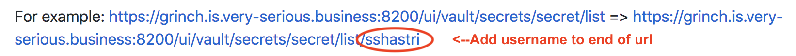

# Grinch Holiday Gift Exchange   ❄️ ☃️ 🎁 🍻 ❄️

OK - you are here! You have selected your gift(s) online. What do you do now?


## Prerequisites
- github account OR username/password provided by Culture Czar
- url of gift(s) (comma separated)
- description of gift(s) 
- address you want the gift shipped to
- credit card details and SSN (just kidding...)

## Web Instructions (for username/password)

1. Go to <a href="https://grinch.is.very-serious.business:8200" target="_blank">https://grinch.is.very-serious.business:8200</a> 

Note: You may have a pop-up message asking you to import a certificate. Enter your computer password to accept the certificate.

2. Disregard the Namespace field. Select the Method `Username` from the drop down 

3. Enter your provided username and password and click Sign In.

3. Under Secret Engines, click on secret

4. This will put you on a page that says "Not Authorized" 
IN THE BROWSER URL BAR, add your username to the URL and hit enter



6. There should be items listed (address and gift) These are keys in the Key/Value store. We need to update the "value"


7. Click into each key (address and gift) and hit `Edit Secret` in the top right side. Update and save the values. For example, the gift key looks like:


Note:<br> 
description = a description of your gift(s) (Ex: Hello Kitty Socks and Shoes) <br>
url = link to the gift(s) for online purchase, separate multiple urls w/ a comma (Ex: http://hellokitty.com/socks, http://hellokitty.com/shoes)<br>
address (example)= "1600 Pennsylvania Ave., Washington, D.C., 20500, USA"

8. Logout. Congratulations you are done!

## Command Line Instructons (for people with a team-is GitHub account)

1. Authenticate to Vault using your github token

```bash
export $VAULT_ADDR=https://grinch.is.very-serious.business:8200
vault login -method=github
GitHub Personal Access Token (will be hidden):

```

2. Insert Gift to Vault (PLEASE READ CAREFULLY, automation depends on correct key/value combo)

Example Key Value Entry:

url="http://hellokitty.com/socks, http://hellokitty.com/shoes" description="Hello Kitty Socks and Shoes"

```
vault kv put secret/<github_id>/gift \
url="http://hellokitty.com/socks, http://hellokitty.com/shoes" \
description="Hello Kitty Socks and Shoes"
```

3. Enter your shipping address 

```
vault kv put secret/<github_id>/address \
address="1600 Pennsylvania Ave., Washington, D.C., 20500, USA"
```


